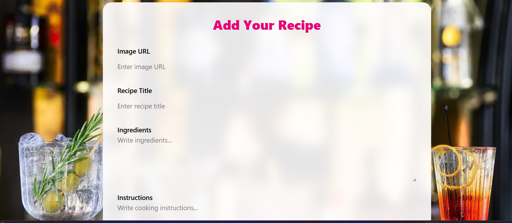
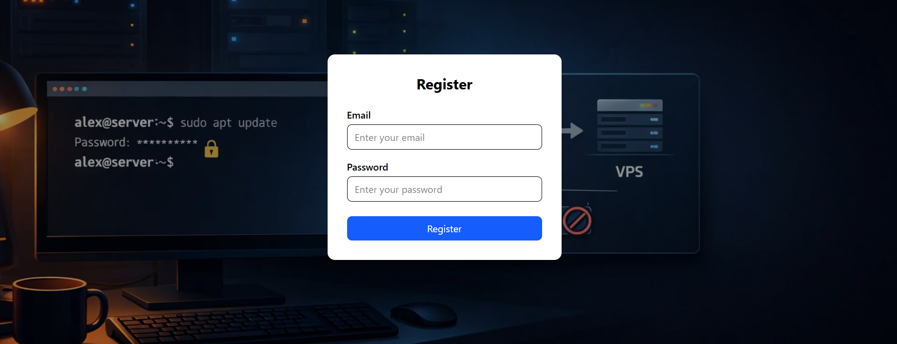

Server Side Deployment(Vercel) : https://recipe-book-server-pearl.vercel.app/allRecipes
Client Side Deployment(Firebase) : https://subscription-box-apps.web.app/home

Screen Shots:

Add Recipe page 

Authentication page:

🍳 RecipeBook | Discover, Create, and Share
RecipeBook is a dynamic, full-stack Single Page Application (SPA) designed for food enthusiasts. Whether you are a home cook looking to archive your best dishes or a foodie searching for inspiration, RecipeBook provides a seamless platform to manage recipes, explore global cuisines, and engage with a community of creators.

Live Site: [Insert Your Hosted URL Here]

Server Repository: [Insert Server Repo Link Here]

🌟 Key Features
Curated Top Recipes: A dynamic home screen featuring the top 6 most-liked recipes, globally fetched and sorted using MongoDB aggregation.

Complete Recipe Management: Authenticated users can create, view, and manage their personal culinary collection with detailed categorization (Cuisine, Prep Time, Meal Type).

Secure Authentication: Integrated Firebase Authentication providing Email/Password registration with strict validation and one-click Google Social Login.

Fully Responsive Design: A mobile-first approach ensuring a beautiful, functional experience across smartphones, tablets, and desktops.

Private Route Protection: Secure access to recipe details and creation forms; unauthorized users are redirected to login, while active sessions are preserved on page refresh.

🛠️ Tech Stack
Client: React.js, Tailwind CSS, DaisyUI, React Router Dom, Firebase Auth.

Server: Node.js, Express.js.

Database: MongoDB.

Deployment: Netlify/Firebase (Client), Vercel (Server).

🚀 Installation & Local Setup
1. Clone the repository
Bash
git clone [your-client-repo-link]
cd recipe-book-client
2. Install dependencies
Bash
npm install
3. Environment Variables
Create a .env.local file in the root and add your credentials:

Code snippet
VITE_apiKey=your_firebase_api_key
VITE_authDomain=your_project_auth_domain
VITE_projectId=your_project_id
VITE_storageBucket=your_storage_bucket
VITE_messagingSenderId=your_sender_id
VITE_appId=your_app_id
4. Run the Application
Bash
npm run dev
📖 Application Structure
🏠 Home Page
Hero Banner: Eye-catching slider showcasing featured dishes.

Top Recipes: A 3-column grid displaying the most popular community recipes.

Extra Sections: "Chef of the Month" and "Seasonal Ingredients" sections for added engagement.

🍱 Recipe Discovery
All Recipes: A comprehensive 4-column grid of every recipe contributed to the platform.

Recipe Details: A protected view showing ingredients, step-by-step instructions, and the interactive "Like" system.

🔐 User Experience
Smart Navbar: Conditional rendering based on Auth state (Avatar/Logout for users, Login/Register for guests).

Custom 404: A themed "Page Not Found" experience to keep users within the app's aesthetic.

Feedback System: No default browser alerts; all success and error states are handled via professional Toast notifications or SweetAlerts.

📝 Development Notes
Clean Code: Avoided Lorem Ipsum text; all content is context-relevant.

Security: MongoDB credentials and Firebase keys are strictly hidden via server-side and client-side environment variables.

Route Handling: Implemented specialized loaders to prevent "Redirect to Login" bugs on page reloads for authenticated users.